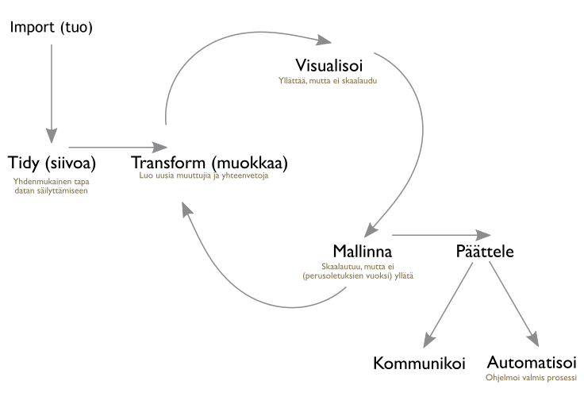

`Sivusto generoitu viimeksi: `r Sys.time()``

Kurssin tavoitteena on opettaa *käytännön perustiedot ja -taidot data-analyysin koko prosessin hallintaan R-kielen suosituimmilla työkaluilla* kuten `knitr`,`tidyr`,`dplyr` tai `ggplot2`. Kohderyhmänä ovat opiskelijoille joilla on jo kokemusta data-analyysista muilla työkaluilla ja mahdollisesti myös R:n perustyökaluilla. Kurssi ei ole R-kielen peruskurssi, ja on suositeltavaa käydä kurssi [TILM3517 R-kielen alkeet 2 op](https://nettiopsu.utu.fi/opas/opetusohjelma/marjapuuro.htm?id=10556) joko ennen kurssia tai pikimmiten sen jälkeen.

- **Opettaja:** [Markus Kainu](http://markuskainu.fi/)
- **Sähköposti:** `markuskainu@gmail.com` (ks. [sähköpostipolitiikka](ukk.html#sahkopostipolitiikka))
- **Koodi:** SOSI1225 A.5
- **Laajuus:** 3op
- **Ajankohta:** Syyskuun 12. - lokakuun 10. 2016
- **Luentojen aika:** Maanantaina klo 8.15-9.45
- **Luentosali:** SaliX

## Kuvaus

Kurssilla käydään tiiviisti läpi R-kielen kenties suosituin data-analyysin prosessi josta käytetään nimeä  *hadleyverse* tai *tidyverse*. Nimi viittaa [Hadley Wickhamin](http://hadley.nz/)  kirjoittamien pakettien ja [tidy data](https://cran.r-project.org/web/packages/tidyr/vignettes/tidy-data.html) -lähestymistavan muodostamaa kokonaisuutta (ks. alla oleva kuva).

Kurssilla opitaan *tidy data* -lähestymistavan ohella myös ohjelmistokehityksen perustyökalujen käyttöä kuten versiohallintaa. Kaikki uudet työkalut otetaan käyttöön heti kurssin alussa ja ne opetellaan käytännön kautta.

## Aikataulu

| Päivä | Aika        | Paikka | Materiaalit                       | Kotitehtävät     |
| ----  | -------     | ----   | -------------------------         | ------------  |
| 12.9. | 08.15-09.45 | Sali X | [Johdanto, ohjelmistot ja versiohallinta](./content_1_intro.html)         | [kotitehtava_1.R](https://raw.githubusercontent.com/muuankarski/utur2016/master/kotitehtavat/kotitehtava_1.R) |
| 19.9. | 08.15-09.45 | Sali X | [Datan tuominen ja siivoaminen](./content_2_import_tidy.html)             | [kotitehtava_2.R](https://raw.githubusercontent.com/muuankarski/utur2016/master/kotitehtavat/kotitehtava_2.R) |
| 26.9. | 08.15-09.45 | Sali X | [Datan muokkaaminen](./content_3_transform.html)                          | [kotitehtava_3.R](https://raw.githubusercontent.com/muuankarski/utur2016/master/kotitehtavat/kotitehtava_3.R) |
| 3.10. | 08.15-09.45 | Sali X | [Datan visualisoiminen ja mallintaminen](./content_4_visualise_model.html)| [kotitehtava_4.R](https://raw.githubusercontent.com/muuankarski/utur2016/master/kotitehtavat/kotitehtava_4.R) |
| 10.10.| 08.15-09.45 | Sali X | [Tulosten raportointi](./content_5_communicate.html)                      | [kotitehtava_5.R](https://raw.githubusercontent.com/muuankarski/utur2016/master/kotitehtavat/kotitehtava_5.R) |

Lataa kurssiaikataulu omaan kalenteriin: [utur2016.ics](./utur2016.ics)

## Lähdekoodi

Ajantasainen lähdekoodin löytyy [Github](https://github.com/)-koodinjakopalvelusta polusta: <https://github.com/muuankarski/utur2016>.

