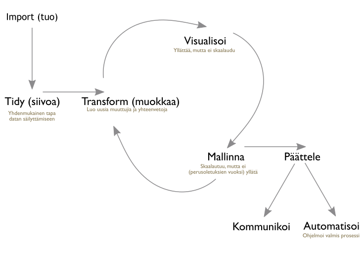

`Sivusto generoitu viimeksi: `r Sys.time()``

Parahin lukija, 

Tervetuloa Turun yliopiston sosiaalitutkimuksen laitoksen *Soveltavan data-analyysin perusteet R-kielellä* -kurssin sivuille. Tämä kurssi ei ole perinteinen johdatus R-kieleen vaan kurssin tavoitteena on opettaa *lyhyessä ajassa käytännön taidot data-analyysin koko prosessin hallintaan R-kielen suosituimmilla työkaluilla* opiskelijoille joilla on jo paljon kokemusta data-analyysista muilla työkaluilla ja kenties myös R:n perustyökaluilla.

Kurssilla käydään tiiviisti läpi R-kielen kenties suosituin data-analyysin prosessi josta käytetään nimeä  *hadleyverse* tai *tidyverse*. Nimi viittaa [Hadley Wickhamin](http://hadley.nz/)  kirjoittamien pakettien ja [tidy data](https://cran.r-project.org/web/packages/tidyr/vignettes/tidy-data.html) -lähestymistavan muodostamaa kokonaisuutta (ks. alla oleva kuva).

Kurssilla opitaan *tidy data* -lähestymistavan ohella myös ohjelmistokehityksen perustyökalujen käyttöä kuten versiohallintaa. Kaikki uudet työkalut otetaan käyttöön heti kurssin alussa ja ne opetellaan käytännön kautta.

Kurssilla hyödynnetään [Tieteen tietotekniikan keskuksen (CSC)](http://csc,fi) *Pouta Blueprints*  laskentaympäristö, joita opiskelijat voivat käyttää haka-verkon kautta pelkkää selainta käyttäen joko mikroluokkien koneilla tai omalla koneella. Kurssin edetessä halukkaat voivat rakentaa myös vastaavan ympäristön omalle koneelleen omatoimista käyttöä varten.

Kurssilla käytettävät ohjelmistot ovat poikkeuksetta [vapaita](https://fi.wikipedia.org/wiki/Vapaa_ohjelmisto) ja [avoimen lähdekoodin ohjelmistoja](https://fi.wikipedia.org/wiki/Avoin_l%C3%A4hdekoodi), joita voi käyttää sekä Windowsissa, OSX:ssä että eri linux-jakeluissa.

## Kurssikalenteri

| aika | paikka | materiaalit | kotitehtävät |
| ---  | ----   | ----        | ----         |
| 21. syyskuuta | Sali X | [Johdanto, ohjelmistot ja versiohallinta](content_1_intro.html)          | [kotitehtava](content_1_intro.html#kotitehtava)       |
| 21. syyskuuta | Sali X | [Datan tuominen ja siivoaminen](content_2_import_tidy.html)              | [kotitehtava](content_2_import_tidy.html#kotitehtava)      |
| 22. syyskuuta | Sali X | [Datan muokkaaminen](content_3_transform.html)                           | [kotitehtava](content_3_transform.html#kotitehtava)   |
| 22. syyskuuta | Sali X | [Datan visualisoiminen ja mallintaminen](content_4_visualise_model.html) | [kotitehtava](content_4_visualise_model.html#kotitehtava)   |
| 22. syyskuuta | Sali X | [Tulosten raportointi](content_5_communicate.html)                       | [kotitehtava](content_5_communicate.html#kotitehtava) |

## Materiaalien lähdekoodi

Ajantasainen lähdekoodin löytyy [Github](https://github.com/)-koodinjakopalvelusta polusta: <https://github.com/muuankarski/utur2016>.

